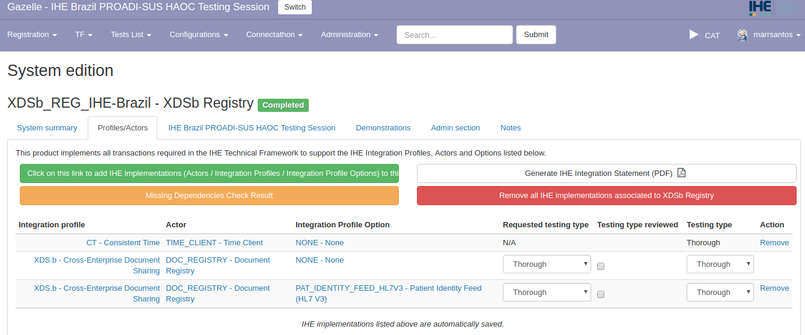

# Instrução para Registro de Sistemas no Gazelle

Esta página descreve os passos básicos para cadastramento de organização, contatos e registro de sistemas para uma organização no sistema Gazelle Test Management.

### 1. Criar nova conta de usuário no Gazelle

*Conceitos:*

Um "usuário" representa uma pessoa com login e senha para acessar a ferramenta Gazelle Test Management. Um usuário está sempre vinculado a
uma organização, e somente pode visualizar/alterar informações para essa
organização.

Para criar um novo usuário, acesse a página inicial do Gazelle e clique em "Create an Account".

Na sequência, preencha os dados para o novo usuário. No campo nome da organização, selecione uma organização existente ou clique em “New Company” para criar uma nova organização.

- Organization Keyword: acrônimo para a organização em cadastro. Este acrônimo será importante durante o cadastro de sistemas pois fará parte do "codinome" dos sistemas que serão cadastrados para esta organização. 

Concluindo o cadastro, o Gazelle enviará uma confirmação para o e-mail informado.

Abra o software de e-mail e clique no link recebido para realizar a confirmação. Retorne ao sistema Gazelle e faça login com a nova conta de usuário criada. 

O Gazelle fará login automático para a seção de testes “Connectathon do IHE USA”. Clique em “Switch”, no canto superior direito, para selecionar a seção de testes correta.

Verifique a lista de seções de testes e selecione a seção “IHE BRAZIL PROADI-SUS HAOC”.

Após clicar na seção de testes correta, o sistema Gazelle automaticamente irá logar nesta seção. Observe no canto superior direito da tela se a seção de testes foi devidamente selecionada e se o logo do IHE Brasil aparece no canto superior esquerdo.

### 2. Cadastrar Contatos da Organização

*Conceitos:*

Um "Contato" é uma pessoa em sua organização que irá interagir com os organizadores da Maratona de Conectividade durante a preparação e execução de uma sessão de teste. Um "contato" pode ou não, ter uma conta de "usuário" no Gazelle.

Para inserir/atualizar informações de contatos no Gazelle utilize o menu Registration -&gt; Manage Contacts.

Clique no link "Add a Contact" para inserir o nome, e-mail e telefone para os contatos na sua organização.

A partir deste momento, digite os detalhes de cada contato e, ao final, clique em “Save”.

Importante lembrar que uma organização deve identificar:

- Contato Financeiro (apenas 1)

- Contato de Marketing (0 ou mais)

- Contato Técnico (1 ou mais)

### 3. Cadastrar Usuários para a Organização

*Conceitos:*

Papéis de um usuário:

- “Vendor” (usuário padrão): pode gerenciar os testes e configurações para os sistemas de uma organização.

- “Vendor\_admin” (Administrador): além de testes e configurações, pode gerenciar usuários relacionados à sua organização (ativar / desativar contas), contatos e participantes para a sessão de teste.

Para cadastrar usuários, acesso o menu Registration -&gt; Manage users.

Informe os dados solicitados para os novos usuários, e clique em “Save” ao final.

### 4. Cadastrar Sistemas para uma Organização

*Conceitos:*

No Gazelle Test Management, o termo "sistema" refere-se a um conjunto de funcionalidades de aplicações expressas em termos de perfis, atores e opções do IHE. Uma organização pode registrar um ou mais sistemas para uma sessão de teste.

O "sistema" participa da sessão de teste para interoperar com "sistemas" pares de outras organizações.

O registro destes sistemas no Gazelle é uma etapa muito importante pois os perfis, atores e opções selecionados orientam muito do que acontece durante uma sessão de teste, por exemplo:

- quais ferramentas de teste serão utilizadas?

- quais testes serão obrigatórios a executar?

- quem serão seus parceiros de teste?

IMPORTANTE: antes de proceder com o cadastro no sistema Gazelle, faça uma leitura minuciosa do Framework Técnico do IHE correspondente aos perfis que serão testados.

Utilize o menu Registration -&gt; Manage Systems para iniciar a função de cadastro de sistemas.

Clique em “Add a System” para adicionar um novo sistema para a organização.

- Organization Keyword - acrônimo da organização proprietária do sistema.
- System/Product Name - nome atribuido ao sistema. Como a organização se refere ao sistema. 
- System type - categoria genérica do sistema, por exemplo: PACS, EHR, XDS.b_REP, etc. 
    - Nota 1: as categorias são amplas e não existe resposta correta ou errada para este campo. Utilize o bom senso para realizar esta categorização.
    - Nota 2: a categoria escolhida fará parte do "codinome" do seu sistema, e será a forma como outras empresas participantes da maratona identificarão o sistema da sua empresa.
- System keyword - "codinome" que será associado ao sistema/produto em cadastro. Trata-se da combinação do campo System Type e o acrônimo informado nos dados da organização.

- Version - campo opcional que permite informar a versão do sistema/produto em cadastro.

- Owner - usuário técnico responsável por gerenciar o sistema durante a preparação e realização da semana de maratona de testes.

Depois de inserir as informações requeridas, clique em “Save”.

Na sequência, clique em Profile/Actors.

Clique no botão verde “Add IHE implementations” para que a tela de seleção de perfis, atores e opções seja iniciada.

Observe que o campo "Integration Profile" irá apresentar apenas os perfis disponíveis para teste na Maratona de Conectividade. 

Utilize os botôes e opções disponíveis para selecionar todas as combinações de perfis, atores e opções que representam os testes que a organização pretende realizar para o sistema em questão.

Para facilitar, selecione o perfil de integração e o ator em análise. Por exemplo, Perfil: "PDQv3 Patient Demographics Query" e ator: "PDC - Patient Demographics Consumer". Na sequência, selecione a combinação (ou combinações) dentre as alternativas apresentadas.

A cada seleção de perfil, ator e opção, clique no botão “Add this IHE implementation to this system” para que a combinação perfil/ator/opção selecionada seja incorporado para o sistema.

Repita este procedimento até que todos os perfis/atores/opções estejam devidamente cadastrados para o sistema em questão.

----

### IMPORTANTE

> Após o período de registro, o Gerente Técnico do IHE analisará as combinações de perfil/ator/opção escolhidas, podendo, eventualmente, acrescentar ou remover alguma combinação em função da análise do conjunto completo de testes para a maratona.

> Para a Maratona de Conectividade do PROADI-SUS HAOC considere as seguintes combinações de perfis/atores/opções:**

- **_Para sistemas consumidores e fornecedores de documentos_**

Integration profile |	Actor |	Integration Profile Option  
--------------------|---------|----------------------------
ATNA - Audit Trail and Node Authentication	| SA - Secure Application	| NONE - None  
CT - Consistent Time| TIME_CLIENT - Time Client|	NONE - None  
XDS.b - Cross-Enterprise Document Sharing |	DOC_CONSUMER - Document Consumer | NONE - None
XDS.b - Cross-Enterprise Document Sharing |	DOC_SOURCE - Document Source | NONE - None
XDS.b - Cross-Enterprise Document Sharing |	DOC_SOURCE - Document Source |	DOC_REPLACE - Document Replacement

- **_Para sistemas consumidores e fontes de identificadores de pacientes_**

Integration profile |	Actor |	Integration Profile Option  
--------------------|---------|----------------------------  
ATNA - Audit Trail and Node Authentication	| SA - Secure Application	| NONE - None  
CT - Consistent Time| TIME_CLIENT - Time Client|	NONE - None  
PDQV3 - Patient Demographic Query HL7 V3|PDC - Patient Demographics Consumer|NONE - None
PDQV3 - Patient Demographic Query HL7 V3|PDC - Patient Demographics Consumer| CONTINUATION - Continuation Option
PDQV3 - Patient Demographic Query HL7 V3|PDC - Patient Demographics Consumer|PEDIATRIC_DEMOG - Pediatric Demographics
PIXV3 - Patient Identifier Cross-Reference HL7 V3 |	PAT_IDENTITY\_CONSUMER - Patient Identifier Cross-reference Consumer |	NONE - None
PIXV3 - Patient Identifier Cross-Reference HL7 V3 |	PAT_IDENTITY\_SRC - Patient Identity Source	| NONE - None
PIXV3 - Patient Identifier Cross-Reference HL7 V3 | PAT_IDENTITY\_SRC - Patient Identity Source	| PEDIATRIC_DEMOG - Pediatric Demographics

----

Dependendo do perfil selecionado, pode aparecer um botão laranja chamado “Missing dependencies” indicando que existe alguma dependência identificada.

Se este for o caso, pressione este botão para que o sistema Gazelle faça a sugestão dos perfis/atores que precisam ser analisados/adicionados para solucionar a dependência. 

> IMPORTANTE: Somente inclua informações nos panels "System Summary" e "Profile/Actors". Os demais panels não devem ser alterados.

> IMPORTANTE: Não altere dados para os campos "Requested testing type", "Testing type reviewed" e "Testing type". 

Ao clicar nas combinações selecionadas, nos campos "integration profile", "Actor" ou "Integration Profile Option" o Gazelle apresentará informações sobre o item selecionado. Por exemplo, ao clicar no ator "PDQv3 - Patient Demographics Query HL7 v3", o Gazelle abrirá uma janela com informações pertinentes a este perfil.

Ao término desta atividade o sistema permanecerá com o Status "In progress". Somente após a revisão do Gerente Técnico do IHE este status será alterado para "Completed".

