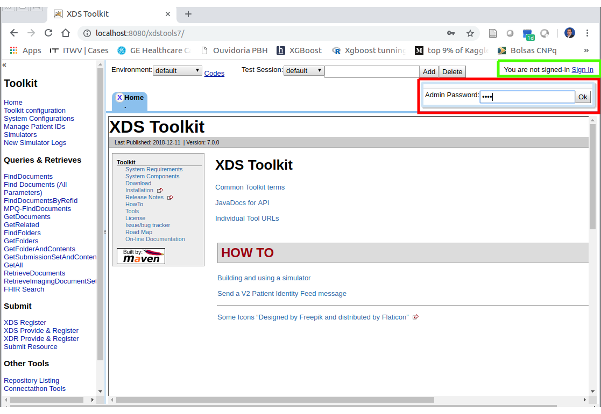
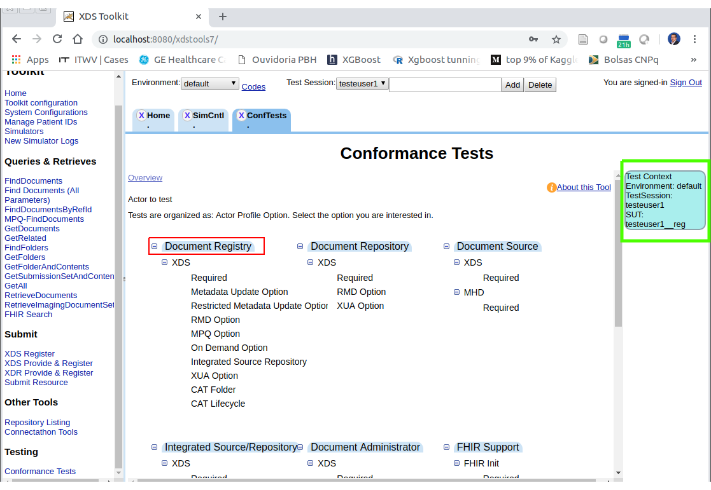

# Considerações sobre instalação da ferramenta NIST XDS ToolKit

O XDS Toolkit é uma coleção de ferramentas de teste focadas no conjunto de perfis para compartilhamento de documentos publicada pelo Integrating the Healthcare Enterprise (IHE). O Toolkit foi desenvolvido pelo Instituto Nacional de Padrões e Tecnologia (NIST) dos Estados Unidos. Trata-se de software de código aberto, de domínio público, não coberto por direitos autorais.

Informações sobre [Download e Instalação](https://github.com/usnistgov/iheos-toolkit2/wiki/installing)

IMPORTANTE: Configuração de cache externo

Se o Cache Externo não estiver configurado, uma mensagem de erro será apresentada na tela na primeira vez que o XDS ToolKit for inicializado. Neste caso, abra o arquivo toolkit.properties dentro da pasta /tomcat/webapps/**SuaApp**/WEB-INF/classes/ e configure apropriadamente o parâmetro: External_Cache.

_SuaAPP -> nome de sua aplicação. Exemplo de path: /opt/tomcat/webapps/xdstools7/WEB-INF/classes/_

O path do external cache não deve ter espaços e caracteres especiais e a pasta precisa ter permissão apropriada.

### Leituras recomendadas

[Cobertura de Perfis IHE](
https://github.com/usnistgov/iheos-toolkit2/wiki/Profile-Coverage)

[XDSTools Administrators](
https://github.com/usnistgov/iheos-toolkit2/wiki/XDSTools-Administrators)

[ToolKit Structure](
https://github.com/usnistgov/iheos-toolkit2/wiki/Toolkit-Structure)

[Security](
https://github.com/usnistgov/iheos-toolkit2/wiki/Security)

[Trabalhando com Simuladores](
https://github.com/usnistgov/iheos-toolkit2/wiki/Using-simulators-instead-of-the-old-Public-Registry-server)

[Conformance test](
https://github.com/usnistgov/iheos-toolkit2/wiki/Conformance-Test-Tool)

### Verificando se a instalação está funcionando

Acesse a instância do XDS Toolkit, clique em “Sign in” e informe a senha “easy”.

Na sequência, crie uma seção de testes. Para isto, informe o nome da seção e clique em “add”.

Crie um simulador de serviço XDS.b Registry. Selecione a opção “Simulators” no menu lateral esquerdo, selecione o ator “Document Registry”, indique um id para este simulador (por exemplo, “rep” e clique em “Create Actor Simulator”. Observe se o novo simulador foi incluído na lista de simuladores para esta seção.

Acesse o menu “Conformance Tests” e, na sequência, clique na opção “Test Context”.

Configure a “Test Session” e o “System Under Test (SUT)” na janela de “Test Context”. Logo após, clique em “Assign System for Test Session”.

Confira se o contexto de teste está correto (Test Session e SUT).  Na sequência, clique nos testes para o ator “Document Registry”.

Selecione o panel “Required”, marque “Reset” para recriar os simuladores e IDs de pacientes. Clique em “Initialize Testing Environment”.

Role a tela para baixo e observe se os parâmetros do SUT (simulador criado nos passos anteriores) e se a inicialização do ambiente ocorreu corretamente (se as linhas referentes aos testes ficaram verdes). Opcionalmente, você pode inspecionar estes testes clicando na linha respectiva de cada teste. 

Logo após, clique no simbolo de “seta” na linha “Document Registry – Requeired Tests” para executar todos os testes contra o SUT (simulador criado).

Observe se todos os 35 testes foram executados com sucesso. Em caso positivo, a plataforma de testes está funcionando bem.