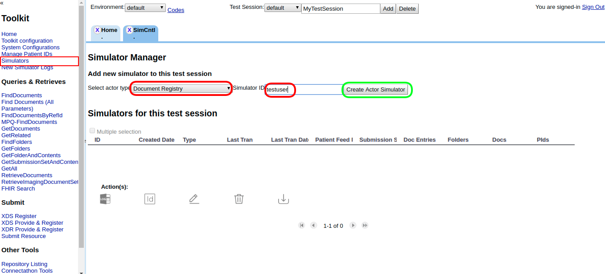
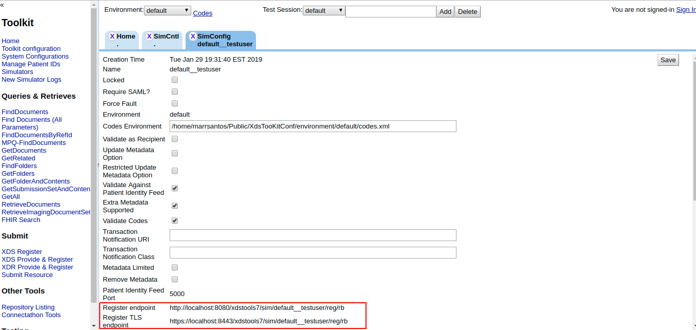
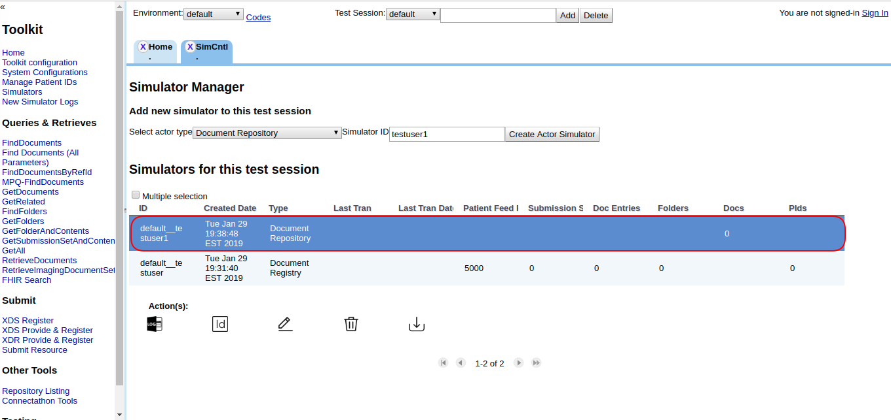
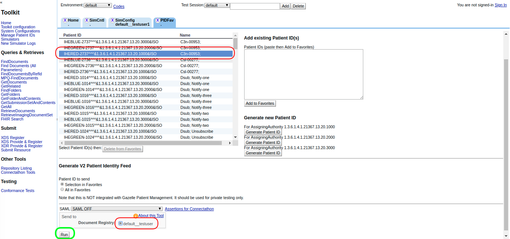
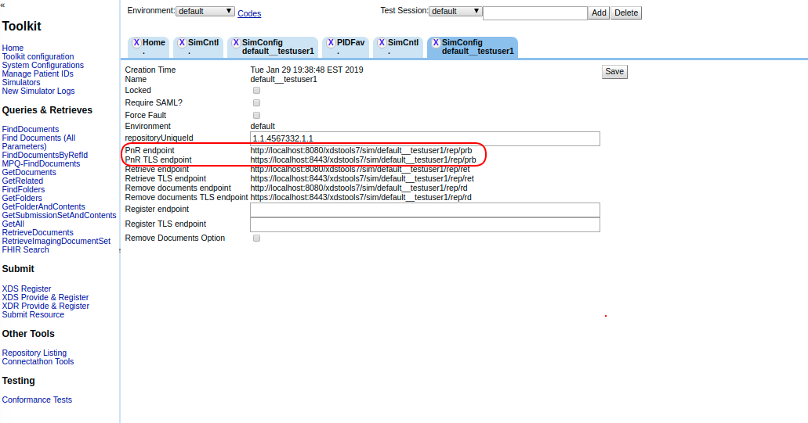

## Test #5003 (Br_XDS-Cons_5003)

FindDocuments Stored Query and generic instructions for testing Document Consumer implementations of Stored Queries.

**References:** ITI TF-2 3.18

**Actor:** Document Consumer

**Resources:** NIST XDS ToolKit

In these test cases, the NIST XDS Tookit acts as a simulator for an XDS.b Document Repository and Document Registry.  This enables an XDS.b Document Source to submit documents to Toolkits, and an XDS.b Document Consumer to query for and retrieve documents.

You must install Toolkit locally before performing these tests.   The XDS Toolkit download and instructions are found here:  https://github.com/usnistgov/iheos-toolkit2/wiki/Toolkit

**Test Procedure**  

1. If you performed the test #5001, please, start at Step 11:

2. Access NIST XDS Toolkit and enter with the admin password (default: "easy")

3. Create a test session or select a proper one. Check if the "default" environment codes is being used.  

4. Go to the “Simulators” menu option. Select "Document Registry" for actor type. Enter with a shortname for your simulator, and click on "Create Actor Simulator" bottom. 

5. Double click on the new Register simulator and take note of the register endpoint.

6. Repeat Step #3 for creating a "Document Repository" simulator. Give it a different shortname.

7. Double click on the new Repository simulator, configure the Registry endpoint (that you have taken note on Step #4) and click on "Save".

8. Go to the “Manage Patient IDs” menu option. Select one patient ID, select your register simulator and click on “Run” bottom to send a patient feed transaction to your register simulator  

9. Go to "Simulators" menu option. Open the Repository simulator you created in the Step #5 and take note of the Repository endpoints. 

10. Use your System Under Test (actor: document source) to submit a Submission Set containing a single Document using the Provide and Register Document Set-b transaction against the Pnr endpoint (or Pnr TLS endpoint).   

11. If you performed the test #5001 then assume same patient ID used on that test. Otherwise, assume Patient ID used at Step 8.  

12. Double click on the new Registry simulator (created in the Step #4. Or if you performed the test #5001, in the Step #3 of that test) and take note of the Stored Query endpoint.

 

13. Use your System Under Test (actor: document consumer) to submit a “FindDocument” Stored Query retrieving all documents for the patient ID against the Store Query endpoint (Step #12).

14. Go to the “Simulators” menu option. Select your registry simulator, click on the “log” action.  

15. Select the “message” you have just generated. Take a screenshot of this screeen and click on the “Download message” option.  

  

16. Post the generated zip file and screenshot to Gazelle Action “return log file”.  

17. Change the status of the pre-connectathon test to "Verified by vendor".