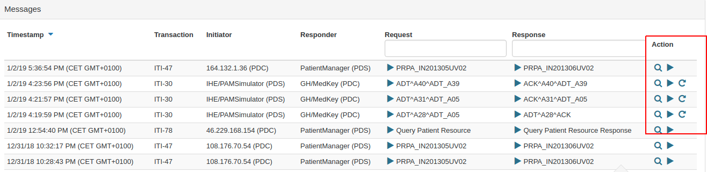

### Test #6001 (Br_PM-PDQv3_Cons_6001)

Verify that PDQ Consumer can submit a Patient Demographics Query (ITI-47) transaction
In these test, you will use the Patient Manager as a Patient Demographics Supplier (PDS) Simulator to respond to your PDQ Query.

**References:** ITI TF-2b 3.47 and ITI TF-2x O.1.1

**Actor:** Patient Demographics Consumer

**Dependencies:** None

**Resources:** [Gazelle Patient Manager](https://gazelle.ihe.net/PatientManager/hl7v3/pdq/supplier.seam)

**Test Procedure**

1. Access the Patient Manager tool: [http://gazelle.ihe.net/PatientManager](http://gazelle.ihe.net/PatientManager)
 
2. Go to menu All Patients. Next, in the drop-down box "Simulated actor", select PDS - Patient Demographic Supplier.  The page then lists the patients known by the PDQ Supplier simulator.
Choose one or more of the available patients to use as the target for your query in  this test.

3. Go to menu PDQ-->Patient Demographic Supplier (PDS). Next, select HL7v3 Configuration.  

4. The tool will display the configuration details you will need to query the PDS Simulator. Ensure the status of the Simulator is "Running".

5. Configure your System Under Test (SUT) to perform query based on the PDS simulator endpoint (collected on Item d). Pay attention to the ITI TF-2b Table 3.47.4.1.2.3-1: Wrappers and Constraints. See example on this [SOAPUI project](https://github.com/ihebrasil/PROADI-SUS-HAOC/blob/master/SOAPUI%20Projects/Gazelle-Patient-Manager-examples-soapui-project.xml).

6. You can use menu HL7 messages to find the query & response captured by the tool

7. Take a screenshot of your application or your database as a proof of receipt of the query response. The screenshot demonstrates that you have successfully processed the received query response(s).

Note 1:  This simulator it will not work if you send an ITI-44 Patient Add and try to retrieve the same patient. Only patients known by the PDQ Supplier simulator can be retrieved. 

Note 2: You can use the menu “Messages Browser” to inspect and validate your messages. Click on the magnifying glass icon to inspect messages.

When inspecting messages you will have the option to verify the validation results.

8. Retrieve the permanent link to the transaction instance from Patient Manager, and paste that as evidence for this test. Generated a ZIP file including all evidences you have collected. Post the generated zip file and screenshot to Gazelle Action “return log file”.  

9. Change the status of the pre-connectathon test to "Verified by vendor".