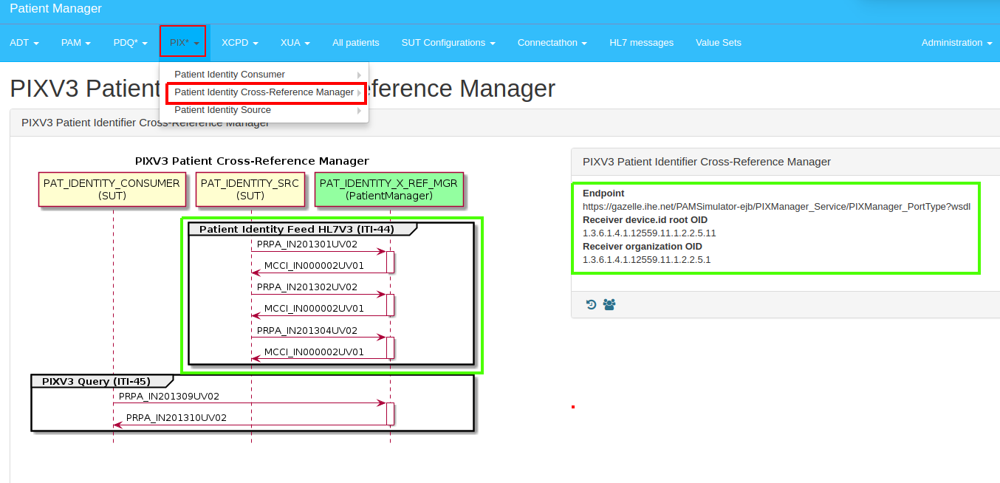
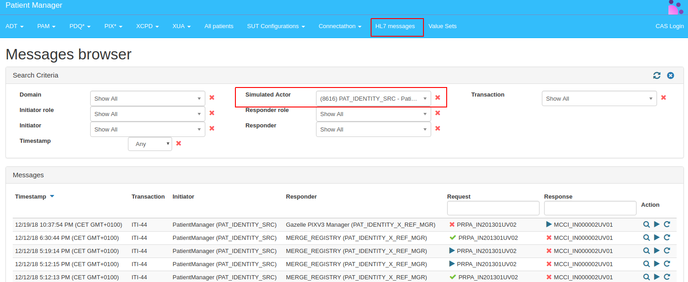
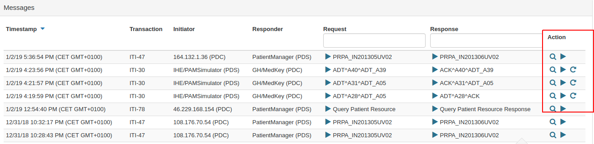
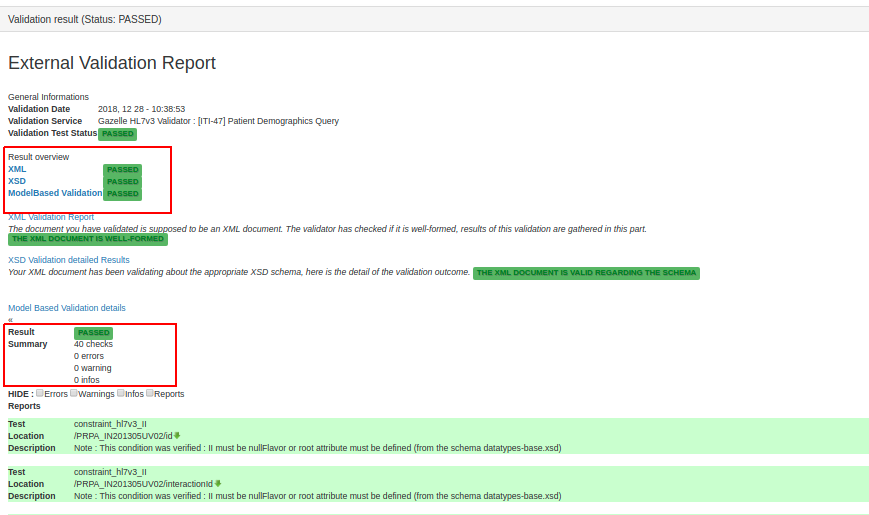

### Test #6003 (Br_PM-PIXv3_Src_6003)

The Patient Identity Source actor must demonstrate 3 capabilities:

- admit/register a patient with PRPA_IN201301UV02: Patient Registry Record Added
- update a patient with PRPA_IN201302UV02: Patient Registry Record Revised
- merge with PRPA_IN201304UV02: Patient Registry Duplicates Resolved

The Patient Identity Source needs to have an Assigning Authority assigned to its own system for identifying that source. Each Patient Identity Source is given a “Patient ID Addigning Authority OID” for testing purposes. See Gazelle Test Management under menu _Configurations-→ OIDs for Current Session_. The Patient Identity Source must use this OID for pre-connectathon and peer-to-peer tests.

> Request the IHE Technical Manager the OID for your company and only perform this test using this OID.

**References:** ITI TF-2b 3.44 Patient Identity Feed HL7 V3 [ITI-44]

**Actor:** Patient Identity Source

**Dependencies:** None

**Resources:** [Gazelle Patient Manager](https://gazelle.ihe.net/PatientManager/hl7v3/pix/xmanager.seam)

**Test procedure**

1. Access the Patient Manager tool: [http://gazelle.ihe.net/PatientManager](http://gazelle.ihe.net/PatientManager).

2. Go to menu PIX → Patient Identifier Cross-Reference Manager. Next, select HL7v3 Configuration.

3. The tool will display the configuration details you will need to query the PIX Manager Simulator. Ensure the status of the Simulator is "Running".

4. Configure your System Under Test (SUT) to perform a Patient Registry Record Added transaction (PRPA_IN201301UV02) against the PIX Manager simulator endpoint.   
   - Create a new Patient named “Maria Auxiliadora Silva” (given=”Maria Auxiliadora” and family=”Silva”), gender “female”, address “Avenida Brasil, 300”/“Belo Horizonte” and Country “Brazil”.   
   - This new Patient will have a new id with the Assigning Authority OID provided by the IHE Technical Manager to your system. Take note of this Patient name and id.    
 > If you need information on representing patient data, please, verify ITI TF-2b Table 3.44.4.1.2.2-1 Model Attributes and check [HL7 v3 value sets](https://gazelle.ihe.net/PatientManager/hl7v3/pix/xmanager.seam) if you need the domain for some attribute.  
 > If you need information on Wrappers and Constraints consider reviewing [ITI TF-2b Table 3.44.4.1.2.3-1](https://www.ihe.net/uploadedFiles/Documents/ITI/IHE_ITI_TF_Vol2b.pdf#page=200) and find proper information model on [ITI 2x Appendice O](https://www.ihe.net/uploadedFiles/Documents/ITI/IHE_ITI_TF_Vol2x.pdf#page=59).  
 > If you need information on HL7 v3 Web Services rules, please, check [ITI TF-2x Apendice V](https://www.ihe.net/uploadedFiles/Documents/ITI/IHE_ITI_TF_Vol2x.pdf#page=123).   

5. Perform another Patient Registry Record Added transaction (PRPA_IN201301UV02) against the PIX Manager simulator endpoint.   
   - Create a new Patient named “Maria [Your Company first Name]” (given=”Maria” and family=”Your Company first Name”), gender “female”, address “Avenida Brasil, 300”/“Belo Horizonte” and Country “Brasil”.   
   - This new Patient will have a new id with the Assigning Authority OID provided by the IHE Technical Manager to your system. Take note of this Patient name and id.  

6. Perform a Patient Registry Record Revised transaction (PRPA_IN201302UV02) against the PIX Manager simulator endpoint.   
   - Update the previous patient “Maria [Your Company first Name]”. Last name stays the same [Your Company first Name] and first name will change from “Maria” to “Maria Auxiliadora”.   

7. Perform a Patient Registry Duplicates Resolved transaction (PRPA_IN201304UV02) against the PIX Manager simulator endpoint.   
   - Merge “Maria Auxiliadora Silva” into to last patient updated (Maria Auxiliadora [Your Company first Name]).   
   - Only Maria Auxiliadora [Your Company first Name] need to survive.  

8. You can use menu HL7 messages to find all ITI-44 requests & responses captured by the tool

9. Take a screenshot of your application or your database as a proof of receipt of all ITI-44 responses. The screenshot demonstrates that you have successfully processed the processed all requests and response(s).

Note 1: You can use the menu “Messages Browser” to inspect and validate your messages. Click on the magnifying glass icon to inspect messages.

When inspecting messages you will have the option to verify the validation results.

10. Retrieve the permanent link to the transaction instance from Patient Manager, and paste that as evidence for this test. Generated a ZIP file including all evidences you have collected. Post the generated zip file and screenshot to Gazelle Action “return log file”.  

11. Change the status of the pre-connectathon test to "Verified by vendor".