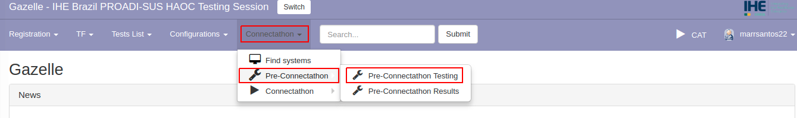
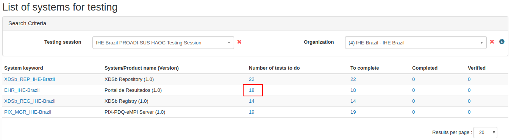
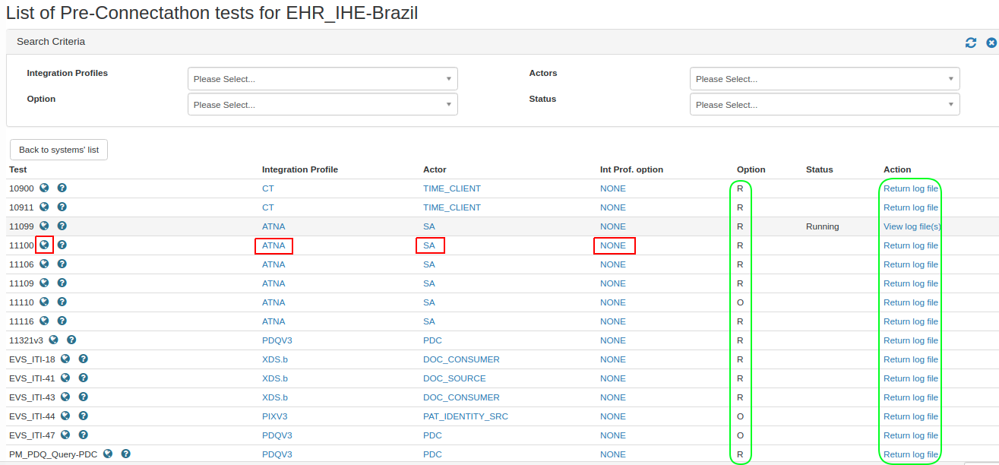
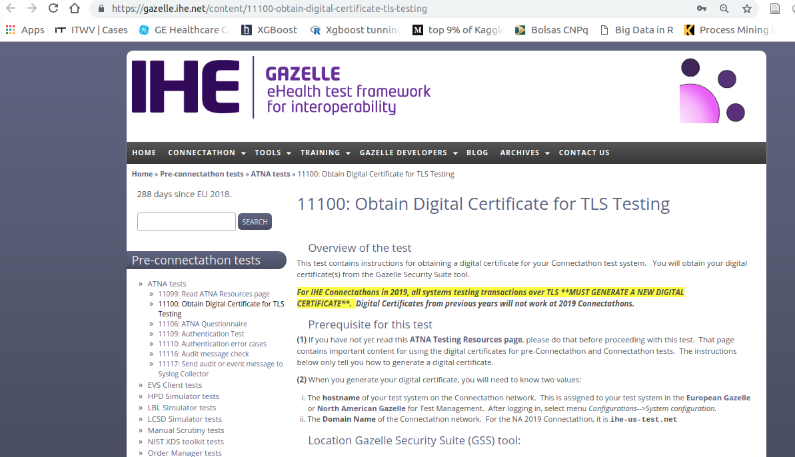
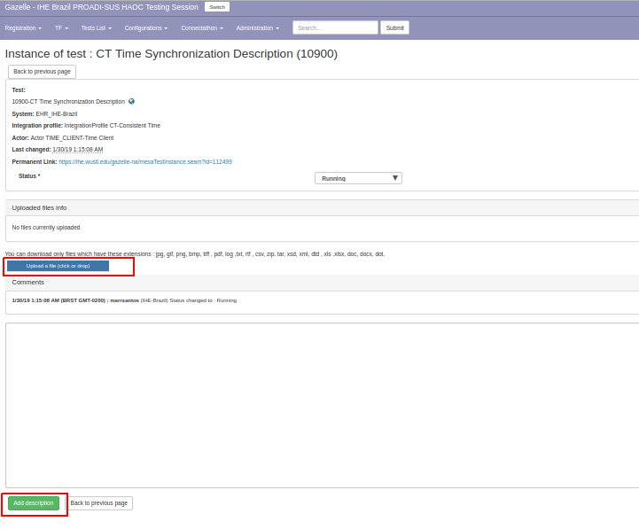
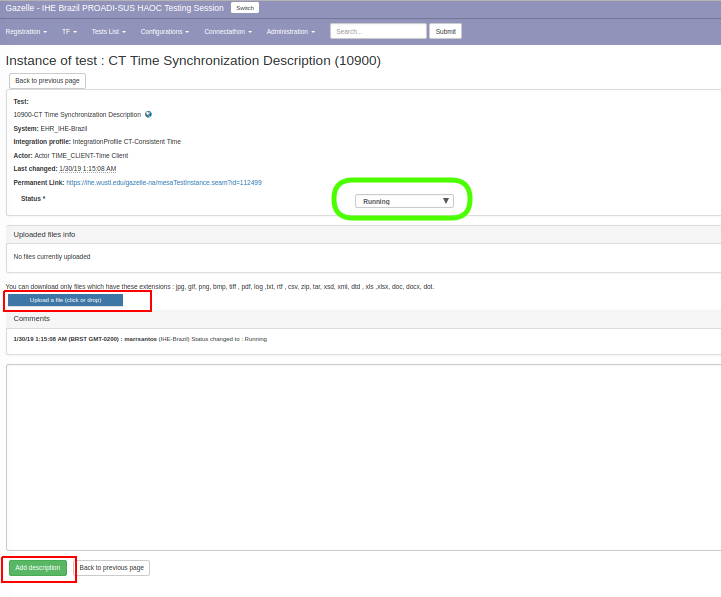

### Instrução para acesso aos testes Pré-Connectathon

1. Acesse o [sistema Gazelle](https://ihe.wustl.edu/gazelle-na/) com o seu usuário

2. Selecione o menu Connectathon opção pre-connectathon / pre-connectathon

3. Visualize os sistemas cadastrados para sua organização e os testes sugeridos para cada um deles.

4. Clique no número de testes a realizar (number of tests to do) para visualizar a lista de testes que correspondem às combinações de perfil/ator/opção registrada para o sistema em análise.

5. A coluna "Option" indica se o teste é obrigatório (R) ou opcional (O). Clique no perfil/ator/opção para ver a documentação relacionada com estes itens. 

> IMPORTANTE: Os testes a seguir estão indicados como "opcionais" no Gazelle mas são obrigatórios para a Maratona de Conectividade no Brasil. A saber:

   - XDS.b Cross-Enterprise Document Sharing  
   
        - ator: Document Source - testes [#5001 (Br_XDS-Src_5001)](tech_inst-3.md) e [#5002 (Br_XDS-Src_5002)](tech_inst-3-2.md)  
        - ator: Document Consumer - teste [#5003 (Br_XDS-Cons_5003)](tech_inst-3-1.md)  

   - PDQv3 Patient Demographics Query

        - ator: Patient Demographics Consumer - testes [#6001 (Br_PM-PDQv3_Cons_6001)](tech_inst-4.md) e [#6002 (Br_PM_PDQv3_Continuation_6002)](tech_inst-4-1.md)

   - PIXv3 Patient Identifier Cross-Referencing 

        - ator: Patient Identity Source - teste [#6003 (Br_PM-PIXv3_Src_6003)](tech_inst-5.md)

6. Clique no "globo" para acessar instruções sobre o teste. 

> Em caso de dúvidas sobre testes a serem realizados e os seus respectivos "passos", converse com o Gerente Técnico do IHE.

6. A coluna "Action" permite acessar a instância de teste e fazer upload de arquivos com resultados ou inserir comentários gerais sobre os testes realizados. Clique em "Return log file" para inserir os resultados de seus testes. 

7. Ao final, altere o status do teste para "Verified by vendor". Após esta alteração, o teste estará disponível para ser também verificado pelos monitores da maratona.

